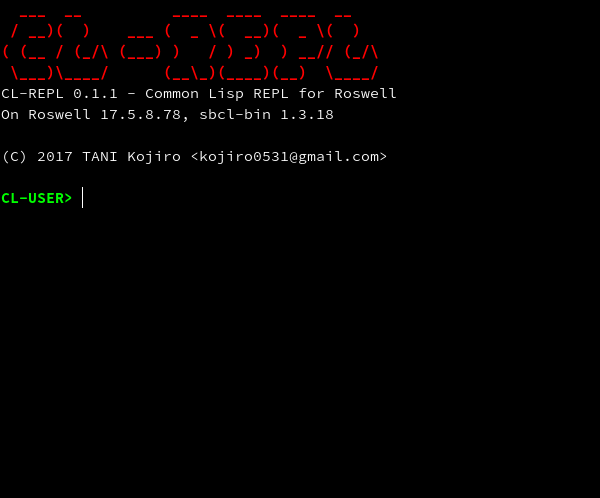

# CL-REPL - Common Lisp REPL for Roswell

[](LICENSE)<br>

<br>

# Overview

CL-REPL is a full-featured repl implementation designed to work with **[Roswell](https://github.com/roswell/roswell/)**, which is strongly inspired by **[SLIME](https://github.com/slime/slime)** and **[IPython](https://github.com/ipython/ipython)**.

## Features

- Portable.<br>
  Written as a **[Roswell script](https://github.com/roswell/roswell/wiki/2.-Roswell-as-a-Scripting-Environment)**.
- Emacs-like key bindings.<br>
  Provides powerful line edditor on REPL.
- Tab-completion. (Currently, supported only on SBCL)
- Shell commands and magic commands.

Of course, the other general features are available! (e.g. debugger)

# Installation

via Roswell.<br>
`$ ros install koji-kojiro/cl-repl`

# Usage

## Shell commands

If the line starts with "!", excute it as shell commnads.

```
CL-USER> !ls
a.txt
CL-USER> !ls -a
.
..
.hidden-file
a.txt
CL-USER>
```

## Magic commands

Some useful magic commands are available. All magic commands have name prefixed "%".

### %load [systems]...

Alias of `(ql:quickload systems... :silent t)`

### %save [file]

Save input history into [file].

### %time [expression]

Measure execusion time of the expression.

# License

CL-REPL is distributed under [MIT license](LICENSE).

# Author

[TANI Kojiro](https://github.com/koji-kojiro) (kojiro0531@gmail.com)
